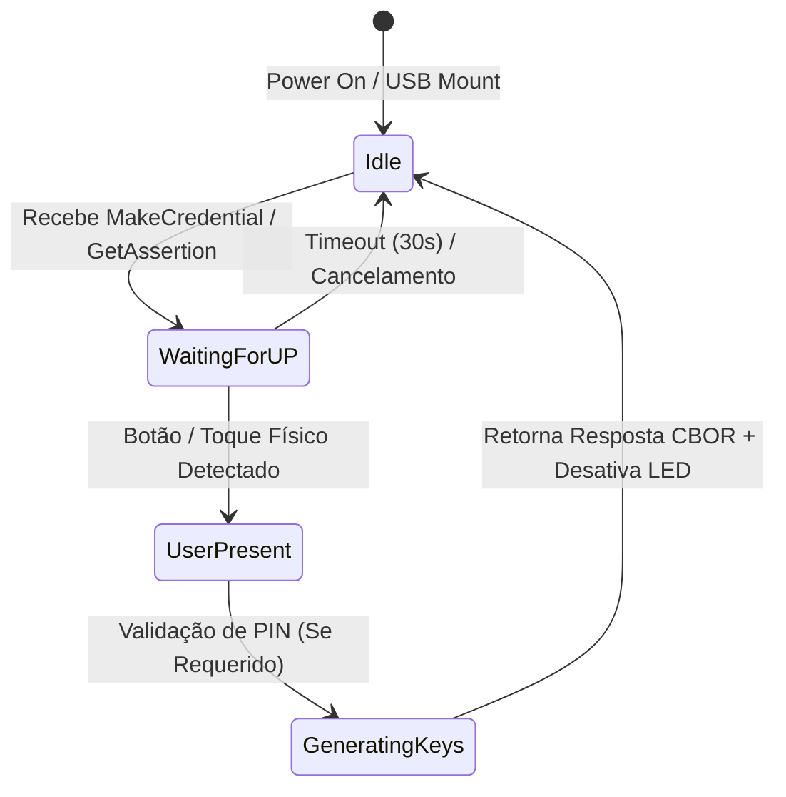

# Máquina de Estados do Protocolo (`docs/protocols/protocol-state-machine.md`)

## 🔄 Transição de Estados do Autenticador

```mermaid
stateDiagram-v2
    [*] --> Idle: Power On / USB Mount
    Idle --> WaitingForUP: Recebe MakeCredential / GetAssertion
    WaitingForUP --> UserPresent: Botão / Toque Físico Detectado
    WaitingForUP --> Idle: Timeout (30s) / Cancelamento
    UserPresent --> GeneratingKeys: Validação de PIN (Se Requerido)
    GeneratingKeys --> Idle: Retorna Resposta CBOR + Desativa LED
```
